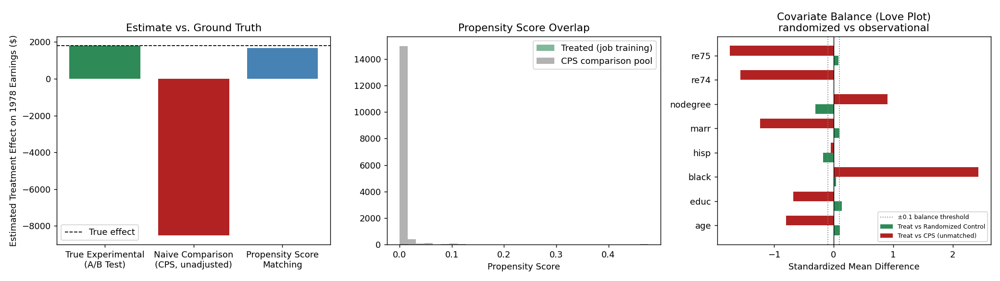

# A/B Testing & Causal Inference

Two related skills, demonstrated on one dataset: (1) properly analyzing a real randomized
controlled experiment, and (2) recovering a valid causal estimate from **non-randomized**
observational data when no randomized control group is available — and validating that estimate
against real experimental ground truth.

## Data

The [LaLonde (1986) / Dehejia-Wahba](https://users.nber.org/~rdehejia/data/nswdata2.html) National
Supported Work (NSW) job training dataset — a real U.S. federal randomized experiment, plus a real
non-experimental comparison sample drawn from the Current Population Survey (CPS). Loaded via the
[`causaldata`](https://pypi.org/project/causaldata/) Python package; also included directly as CSVs
in this repo (`nsw_experimental.csv`, `cps_comparison.csv`) since they're small.

- **NSW experimental sample** (445 people): randomly assigned to job training (treatment) or not
  (control). Outcome: `re78`, real 1978 earnings.
- **CPS comparison sample** (15,992 people): a real, non-randomized general population survey —
  used here as a stand-in "control group" for the case where a real experiment isn't available.

## Part 1 — A/B Test Analysis (the real experiment)

Analyzed the NSW randomized experiment properly:
- **Covariate balance check** across 8 covariates (age, education, race, marital status, prior
  earnings) — confirms randomization worked, with one flagged imbalance (`nodegree`, p=0.001),
  a good reminder that even real randomization can produce chance imbalances in finite samples.
- **Primary outcome test**: two-sample t-test on `re78` (1978 earnings).

**Result:** job training increased earnings by **$1,794** (95% CI: $479–$3,109), t=2.84, p=0.0048 —
statistically significant. This is the **true causal effect**, and the benchmark the rest of the
project is validated against.

## Part 2 — Causal Inference (no randomized control available)

Simulated the realistic scenario where only the treated group is available and a comparison group
has to be built from observational data (CPS) instead.

- **Naive comparison** (just comparing means, ignoring confounding): estimated effect of
  **-$8,498** — wildly wrong, off by over $10,000 from the true effect. CPS respondents are
  systematically different from the job-training population (older, more prior earnings, etc.),
  so a naive comparison mostly measures *who's in each group*, not the effect of training.
- **Propensity score matching**: modeled P(treatment | covariates) via logistic regression, then
  matched each treated person to their nearest-propensity CPS match. Recovered an estimated effect
  of **$1,669** — within $126 of the true experimental effect, a **98.8% reduction in bias**
  versus the naive comparison.



The covariate balance ("Love") plot on the right makes the mechanism visible: the randomized
control group (green) sits tightly within the standard ±0.1 balance threshold on every covariate,
while the raw CPS comparison group (red) is badly imbalanced on nearly all of them — explaining
exactly why the naive estimate failed and why adjustment was necessary.

## Run it

```bash
pip install -r requirements.txt
python analysis.py
```
