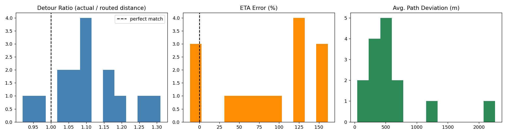
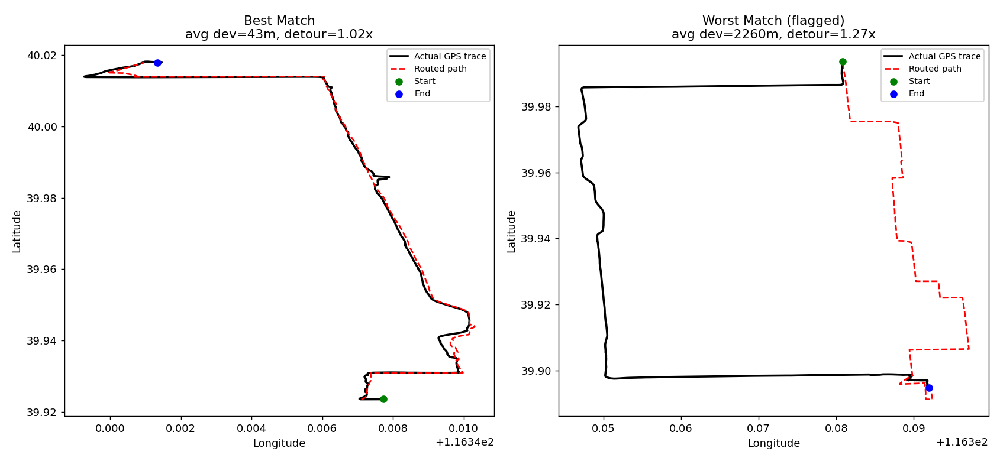

# Routing Quality Evaluation

Evaluates the accuracy and reliability of algorithmically-generated driving routes against real
driver behavior, using real GPS trajectories matched against a real road network.

Built to mirror the kind of work described in map/routing data science roles: is the routing
service's suggested path close to what drivers actually take, and is its ETA trustworthy?

## Data

- **Real GPS trajectories:** [Microsoft Research Geolife GPS Trajectories 1.3](https://www.microsoft.com/en-us/research/publication/geolife-gps-trajectory-dataset-user-guide/) —
  182 users, Beijing-area driving/walking traces, 2007–2012. Not included in this repo (313MB);
  download via the link above.
- **Road network:** [OpenStreetMap](https://www.openstreetmap.org/) drive network for the covered
  area, pulled live via [OSMnx](https://osmnx.readthedocs.io/).

## Method

1. **Trip selection** (`select_trips.py`) — parsed all trajectory files, computed per-trip distance,
   duration, and average speed from raw GPS points, and filtered for real point-to-point urban
   drives: plausible driving speed, no long GPS dropouts, and — critically — the trip's **full path
   extent** (not just start/end points) kept compact enough for a shared road-network graph to fully
   cover it.
2. **Routing** (`routing_quality.py`) — for each selected trip, found the nearest road-network nodes
   to the real start/end GPS points and computed the shortest-distance route via Dijkstra
   (`networkx`).
3. **Evaluation** — compared the real GPS trace against the computed route on three metrics:
   - **Detour ratio** — actual distance driven ÷ routed distance
   - **ETA error** — actual travel time vs. the route's free-flow travel-time estimate
   - **Path deviation** — average distance (meters) from sampled real GPS points to the nearest
     point on the routed path

### A real bug worth noting

The first version sized the road-network download from trip start/end points only. Trips that
looped or ranged far from a straight line between those two points had most of their actual path
fall **outside the downloaded graph entirely** — producing nonsense deviations (some trips averaged
2+ km of "deviation," which is a data-coverage bug, not a real quality signal). Fixed by computing
each trip's true bounding box from its full point sequence before selecting trips and sizing the
graph.

## Results (15 real driving trips, Beijing)

| Metric | Result |
|---|---|
| Mean detour ratio | 1.10 (routes are geometrically close to what drivers actually took) |
| Path-quality flagged (deviation > 800m or detour > 1.2x) | 3 / 15 trips |
| **Median ETA error** | **+98.6%** — actual driving time nearly double the free-flow estimate |
| Trips where actual time exceeded free-flow ETA | 12 / 15 |

**The headline finding:** route *distance* accuracy is good (detour ratios cluster near 1.0), but a
naive free-flow ETA is a poor predictor of real travel time — real trips took roughly 2x longer than
the shortest-path model would estimate, consistent with unmodeled traffic, signals, and stops. This
is exactly the kind of accuracy/reliability gap a routing quality evaluation is meant to surface.




## Run it

```bash
pip install -r requirements.txt
# Download and unzip the Geolife dataset (see Data section above) into this folder first
python select_trips.py
python routing_quality.py
```
