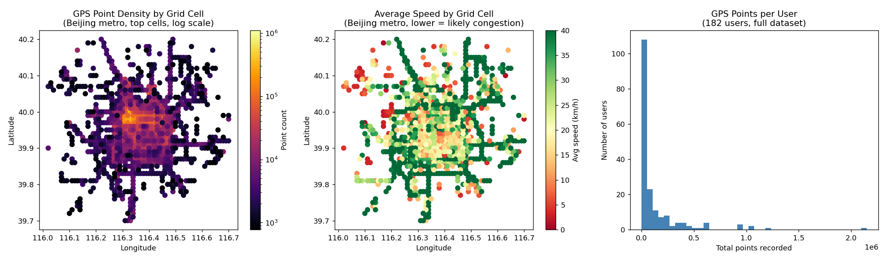

# Large-Scale Geospatial Analysis with PySpark

Distributed processing of ~25 million real GPS points using PySpark — window functions,
spatial aggregation, and per-user analytics at a scale that wouldn't be practical in single-machine
pandas.

## Data

The full [Microsoft Research Geolife GPS Trajectories 1.3](https://www.microsoft.com/en-us/research/publication/geolife-gps-trajectory-dataset-user-guide/)
dataset — **all 182 users, 18,670 trajectory files, ~24.9 million raw GPS points**, 2007–2012.
Not included in this repo (313MB); download via the link above.

## What it does

1. **Distributed ingest**: reads all 18,670 raw `.plt` files in parallel via Spark's
   `wholeTextFiles`, correctly skipping each file's 6-line metadata header before parsing.
2. **Window-function computation**: computes consecutive-point distance and speed per user/trip
   using a Spark `Window` partitioned by `(user_id, trajectory_id)` and ordered by timestamp —
   a genuinely distributed computation, not a single-machine loop.
3. **Spatial aggregation**: bins all points into a ~1.1km grid and aggregates point density,
   average speed, and distinct-user count per cell — the same pattern used for real traffic/demand
   heatmaps.
4. **Per-user rollups**: total distance, trip count, and average speed per user across the full
   dataset.

## Two real bugs fixed along the way

1. **Missing header skip**: a plain `spark.read.csv()` has no per-file header-skip option, so each
   file's 6 metadata lines got parsed as GPS data — corrupting the date/time columns and crashing
   the timestamp cast downstream. Fixed by reading whole files and explicitly dropping the header
   lines before parsing.
2. **A Windows-specific PySpark crash**: `.toDF()` without an explicit schema calls `.first()`
   internally to infer column types. On this machine, `.first()`/`.take()` on a
   `wholeTextFiles`-derived RDD reliably crashed the Python worker process (`Connection reset by
   peer`) — a real byte-buffer transfer issue, not a user code bug. Fixed by passing an explicit
   schema to `createDataFrame()`, which skips that internal inference call entirely.

## Results

- **24,876,978** raw GPS points processed across **182 users**
- **62,013** spatial grid cells with activity
- Full pipeline (ingest → window functions → spatial + per-user aggregation) ran in **~712
  seconds**

The busiest grid cell (central Beijing) alone holds over 1.1 million points from 172 distinct
users — the kind of concentrated, high-volume signal a real mapping/routing team would use to
prioritize road-network accuracy and traffic modeling effort.



## Run it

```bash
pip install -r requirements.txt
# Requires a JDK (Java 17+) on PATH, or set JAVA_HOME
# Download and unzip the Geolife dataset (see Data section above) into this folder first
python spark_geo_analysis.py
python plot_results.py
```
